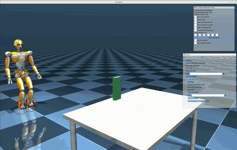

# grasp-fsm-sample-controller

<div align="center">
      <a href="https://youtu.be/7GmmAW5C20o">
     
      </a>
</div>


### Notes

This controller was previously built on top of [LIPM-Walking](https://github.com/jrl-umi3218/lipm_walking_controller) and has since been ported to use [BaselineWalkingController](https://github.com/isri-aist/BaselineWalkingController) for footstep planning and walking.

Assumes `longtable` object and `tallbox` (a box of `size="0.02 0.06 0.15"`) object are placed in the mujoco scene as follows:


```
objects:
  box:
    module: "tallbox"
    init_pos:
      translation: [3.1, 0, 0.9]
      rotation: [0, 0, 0]
  longtable:
    module: "longtable"
    init_pos:
      translation: [3.5, 0, 0.8]
      rotation: [3.14, 0, 0]
```
There is no need to add these objects to `mc-rtc`.

### Build and Install

```sh
$ git clone --recursive git@github.com:rohanpsingh/grasp-fsm-sample-controller.git
$ cd mc_mujoco
$ mkdir build && cd build
$ cmake .. -DCMAKE_BUILD_TYPE=RelWithDebInfo
$ make install
```

### Launch
Edit `mc-rtc` config file:
```yaml
MainRobot: JVRC1
Enabled: GraspFSM
Timestep: 0.002
```

Fire up `mc-mujoco` (or any other interface):

```sh
$ mc_mujoco
```

All states and transitions should occur automatically.
